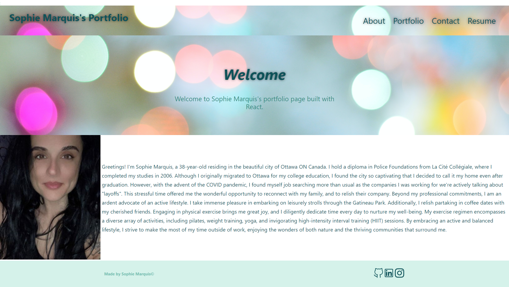

# C20 - REACTPortfolio
Challenge 20 - Boot Camp

[](https://opensource.org/licenses/MIT)


## Table of Contents

  1. [Description of Assignment](#description-of-assignment)
  2. [About](#about)
      1. [User Story](#user-story)
      2. [Acceptance criteria](#acceptance-criteria)   
  3. [License](#license)
  4. [Contact](#contact)
  5. [Final Work Review](#final-work-review)


  ## Description of Assignment

Being a web developer means being part of a community. You’ll need a place to share your projects not only if you're applying for jobs or working as a freelancer but also so that you can share your work with fellow developers and collaborate on future projects.

Now that you’ve completed multiple projects, your task is to create a portfolio, using your new React skills to help set you apart from other developers whose portfolios don’t use the latest technologies.

Just as you did in the module project, you’ll need to deploy this application to GitHub Pages. Follow the same instructions that you did for the project to create a build that you can deploy.

  ## About 

---
### User Story

```
AS AN employer looking for candidates with experience building single-page applications
I WANT to view a potential employee's deployed React portfolio of work samples
SO THAT I can assess whether they're a good candidate for an open position
```
### Acceptance Criteria

```
GIVEN a single-page application portfolio for a web developer
WHEN I load the portfolio
THEN I am presented with a page containing a header, a section for content, and a footer
WHEN I view the header
THEN I am presented with the developer's name and navigation with titles corresponding to different sections of the portfolio
WHEN I view the navigation titles
THEN I am presented with the titles About Me, Portfolio, Contact, and Resume, and the title corresponding to the current section is highlighted
WHEN I click on a navigation title
THEN I am presented with the corresponding section below the navigation without the page reloading and that title is highlighted
WHEN I load the portfolio the first time
THEN the About Me title and section are selected by default
WHEN I am presented with the About Me section
THEN I see a recent photo or avatar of the developer and a short bio about them
WHEN I am presented with the Portfolio section
THEN I see titled images of six of the developer’s applications with links to both the deployed applications and the corresponding GitHub repository
WHEN I am presented with the Contact section
THEN I see a contact form with fields for a name, an email address, and a message
WHEN I move my cursor out of one of the form fields without entering text
THEN I receive a notification that this field is required
WHEN I enter text into the email address field
THEN I receive a notification if I have entered an invalid email address
WHEN I am presented with the Resume section
THEN I see a link to a downloadable resume and a list of the developer’s proficiencies
WHEN I view the footer
THEN I am presented with text or icon links to the developer’s GitHub and LinkedIn profiles, and their profile on a third platform (Stack Overflow, Twitter) 
```

## License

License used for this project - MIT
  * For more information on license types, please reference this website
  for additional licensing information: [https: //choosealicense.com/](https://choosealicense.com/).


  ## Contact

  * GitHub Username: [SMarquis85](https://github.com/SMarquis85)
  * Email: sophienathalie_85@outlook.com


  ## Final Work Review

**"Always leave the code a little cleaner than when you found it."**  This practice has been conscientiously applied to all JavaScript files within the scope of this assignment. The primary resources utilized in the creation of this project were Lawrence Wilson's Audiobook, supplemented by comprehensive references obtained from a diverse array of reputable sources including, but not limited to, W3Schools, DEV, GitHub, Insomnia, Tutorialspoint, as well as invaluable insights gathered from YouTube tutorials and the archive of Zoom class recordings. The result of these efforts is a substantially cleaner, meticulously organized, and highly navigable codebase. Acknowledgments are extended to my dedicated tutor, Erik Hoversten, whose expertise was instrumental in resolving numerous issues encountered during the package installation process. As part of the future development roadmap for this application, a 'Contact Me' section is gradually taking shape, with ongoing updates planned to incorporate newfound knowledge and enhance the online portfolio's perfection.

> **(CARL-VIRT-FSF-PT-04-2023, Challenge 20 / README.md 2023)**

> **(JavaScript Full Stack Developers, Lawrence Wilson; Audiobook (2023) 6hrs and 29mins. )**

## Screenshot:



## Application Link:

https://smarquis85.github.io/C20-REACTPortfolio/ 

## Github Repository Link:

https://github.com/SMarquis85/C20-REACTPortfolio 